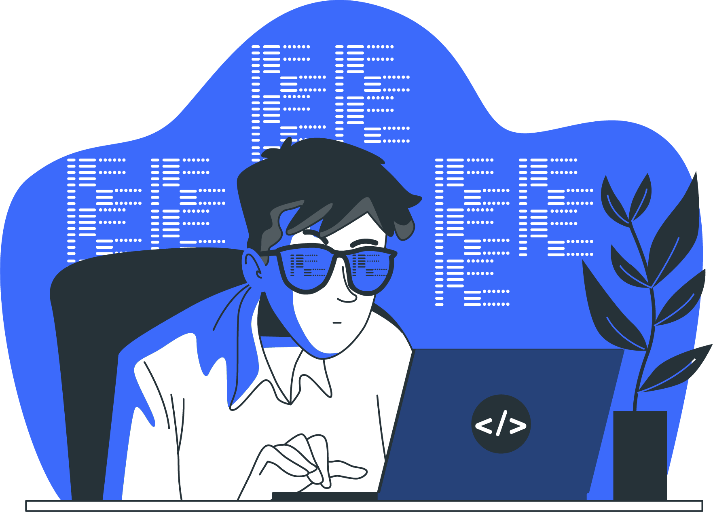

 
  <code>System.out.println("Hello World");</code> 

  Hello, my name is Uemerson Lustosa. I am currently studying Computer Science at the State University of Paraíba - UEPB.
  I am interested in Full-Stack Development.</strong>. 

  💻 Linguagens: <strong>Python, C e Java</strong>. 

  💼 Ferramentas: <strong>Eclipse, VS Code e Figma</strong>. 

  📩 Meus contatos: ⤵️

  
  
  
  
  

